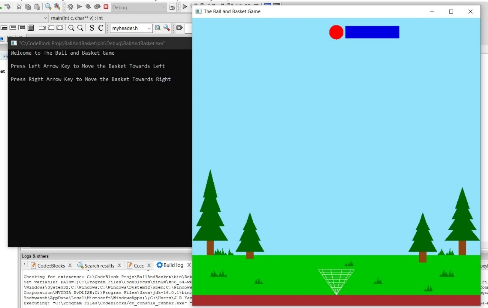

# Ball-and-Basket-Game
A simple game where the ball is dropped from the top and basket is used to catch the ball using OpenGL library function. The basket is controlled by the User using arrow keysof the keyboard. Tools Used: C and OpenGL Library.

## When you run the main.cpp file, the output message will be displayed in Command Prompt.

### Output Message:
Welcome to The Ball and Basket Game

Press Left Arrow Key to Move the Basket Towards Left

Press Right Arrow Key to Move the Basket Towards Right

### Snapshots
Screenshot-1

